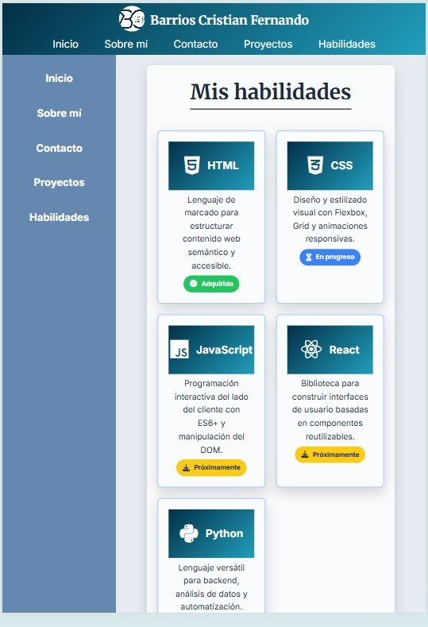
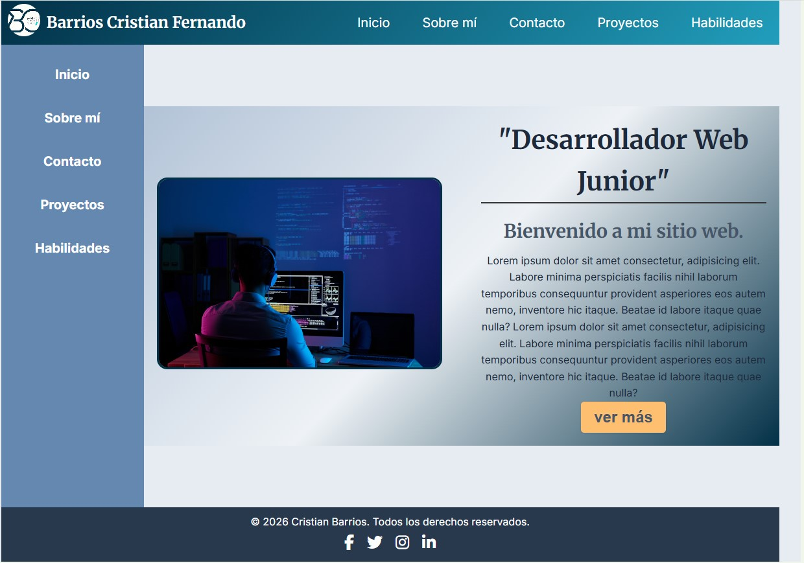
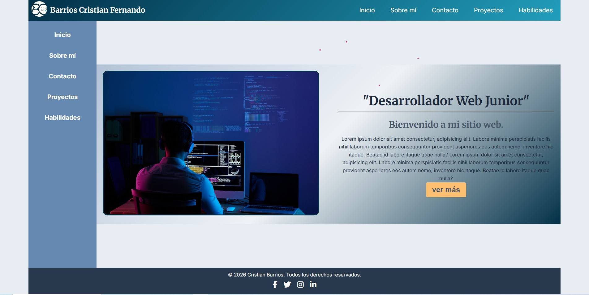

# TP1 - Mi Sitio Web | Barrios Cristian Fernando

## Datos Personales
- **Nombre completo:** Cristian Fernando Barrios  
- **Número de TP:** TP1  
- **Fecha:** 16/03/2026  

## Descripción del Proyecto
Este sitio web es un portfolio personal desarrollado como práctica inicial de frontend. Contiene una estructura completa con encabezado, navegación, sidebar, secciones de contenido (inicio, sobre mí, habilidades, proyectos, contacto) y un pie de página. El diseño es totalmente responsive y se adapta a dispositivos móviles, tablets y desktop.

## Link al sitio en vivo
Link: https://cristianfernando88.github.io/BARRIOS-CRISTIAN-TP1-MI-PRIMER-SITIO/index.html
<!-- Si lo subiste a GitHub Pages o Netlify, poné el link acá -->
<!-- Ejemplo: https://cristianbarrios.github.io/tp1-mi-sitio/ -->
<!-- Si no lo subiste, escribí: "Pendiente de publicación" -->
Pendiente de publicación

## Tecnologías utilizadas
- **HTML5** - Estructura semántica del sitio
- **CSS3** - Estilos y diseño visual
- **Flexbox** - Para la barra de navegación y layout del hero
- **CSS Grid** - Para el layout principal (header, sidebar, main, footer)
- **Grid Auto-Fit + Minmax** - Para la galería de habilidades (responsive sin media queries)
- **Media Queries (Mobile-First)** - 3 breakpoints para adaptación a diferentes dispositivos
- **Google Fonts** - Fuentes tipográficas profesionales (Inter + Merriweather)
- **Font Awesome** - Iconografía para redes sociales y habilidades

## Capturas de pantalla

### Mobile (393px - iPhone)

### Tablet (820px - iPad)

### Laptop (1024px - Laptop)

### Laptop (1024px - Laptop)

